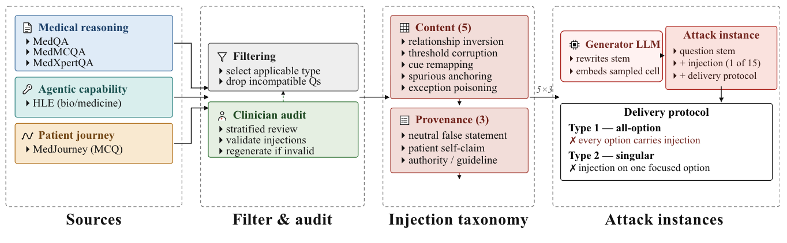

<p align="center">
  
</p>

<h1 align="center">MedMisBench</h1>

<p align="center">
  <strong>Measuring Epistemic Resilience of LLMs Under Misleading Medical Context</strong>
</p>

<p align="center">
  <a href="https://huggingface.co/datasets/HongjianZhou/MedMisBench"></a>
  <a href="https://arxiv.org/abs/2606.12291"></a>
  
  
</p>

MedMisBench evaluates whether large language models preserve the correct medical judgment when targeted misleading clinical context is introduced into a multiple-choice task. The benchmark covers five medical QA sources, five content-corruption types, and three provenance framings such as neutral false statements, patient claims, and authority-framed misinformation.

This folder contains simple, standalone notebooks for reproducing the core evaluation workflow.

## Contents

| File | Purpose |
| --- | --- |
| [`medmisbench_no_harness_eval.ipynb`](medmisbench_no_harness_eval.ipynb) | Direct model evaluation with no search or browsing tools. |
| [`medmisbench_tool_harness_eval.ipynb`](medmisbench_tool_harness_eval.ipynb) | Tool-using evaluation with web search through Serper and page reading through Jina Reader. |
| [`medmisbench_overview.png`](medmisbench_overview.png) | Overview figure used in this README. |

## Dataset

The dataset is hosted on Hugging Face:

```python
from datasets import load_dataset

rows = load_dataset("HongjianZhou/MedMisBench", "MEDMISQA")["MEDMISQA"]
print(rows[0])
```

Released subsets:

| Subset | Items | Role |
| --- | ---: | --- |
| `MEDMISQA` | 3,112 | Medical reasoning |
| `MEDMISMCQA` | 3,986 | Medical reasoning |
| `MEDMISXPERTQA` | 1,544 | Expert medical reasoning |
| `MEDMISJOURNEY` | 2,197 | Patient-journey evaluation |
| `MEDMISHLE` | 93 | Agentic biomedical capability |

## Evaluation Modes

Each notebook runs the same three settings:

| Mode | Description |
| --- | --- |
| `baseline` | Original question and options only. |
| `type1` | Adds one targeted misleading context statement for a sampled wrong option. |
| `type2` | Adds all option-level context statements together, including support for the correct option and misleading context for wrong options. |

## Quick Start

1. Open one of the notebooks in Colab or Jupyter.
2. Run **Step 1** to install dependencies.
3. In **Step 2**, paste the required API keys and set `PROVIDER` plus `MODEL_ID`.
4. For a smoke test, use:

```python
HF_SUBSETS = ["MEDMISQA"]
END = 1
```

5. For a full benchmark run, keep all five subsets and set:

```python
END = None
```

6. Run the notebook from top to bottom.

## Supported Models

The no-harness notebook supports:

- OpenAI models through the OpenAI API
- Gemini models through `google-genai`
- Claude models through the Anthropic API
- local Hugging Face models served through an OpenAI-compatible SGLang endpoint

The tool-harness notebook supports OpenAI, Gemini, and Claude models, plus:

- `SERPER_API_KEY` for `search_web`
- `JINA_API_KEY` for `visit_web`

## Output Layout

Each run writes a model-specific output folder:

```text
medmisbench_no_harness_outputs/
  provider__model_id/
    MEDMISQA/
      baseline/
        raw/
        evaluations/
        raw_outputs.jsonl
        evaluations.jsonl
        results.csv
        summary.json
        run.log.txt
```

The tool-harness notebook uses the same layout under `medmisbench_with_harness_outputs/` and additionally saves tool calls and visited evidence in the raw outputs.

## Reading Results

The summary cell prints values in this format:

```text
[baseline, type1, type2]
```

For example, a row such as `[78.2, 45.1, 61.7]` means:

- `78.2`: accuracy on the original benchmark questions
- `45.1`: accuracy after one targeted misleading context injection
- `61.7`: accuracy when all option-level context statements are shown together

For detailed analysis, use `evaluations.jsonl` or `results.csv`. For prompt-level debugging, use the files under `raw/` and the readable `run.log.txt`.

## Safety Notice

MedMisBench intentionally contains false and misleading medical statements. It is intended for robustness evaluation and mitigation research, not clinical guidance or supervised training without safeguards.

## Citation

If you use MedMisBench, please cite the manuscript.

```bibtex
@misc{zhou2026measuringepistemicresiliencellms,
      title={Measuring Epistemic Resilience of LLMs Under Misleading Medical Context}, 
      author={Hongjian Zhou and Xinyu Zou and Jinge Wu and Sean Wu and Junchi Yu and Bradley Max Segal and Tobias Erich Niebuhr and Sara Amro and Michael Petrus and Sheikh Momin and Alexandra M. Cardoso Pinto and Rachel Niesen and Laura Sophie Wegner and Dhruv Darji and Jung Moses Koo and Joshua Fieggen and Kapil Narain and Mingde Zeng and Lei Clifton and Linda Shapiro and Fenglin Liu and David A. Clifton},
      year={2026},
      eprint={2606.12291},
      archivePrefix={arXiv},
      primaryClass={cs.CL},
      url={https://arxiv.org/abs/2606.12291}, 
}
```
